# Batched ODB execution events in Observe

August 2026.

**Summary: Observe now records a step's execution events as one atomic `addEventBatch`
mutation instead of ~13 individual mutations, cutting the event cost of a step against a
remote ODB from ~2.2 s to ~0.7 s.** Off by default, behind the `odb-event-batching` flag.

---

## What changed

Observe reports execution progress to the ODB as execution events (step stages, dataset
stages, sequence commands). Each event was its own GraphQL mutation, sent synchronously as
a blocking action inside the step pipeline — so every event paid a full network round trip
before the sequence could proceed, and the ODB executes requests from one client strictly
one at a time, so nothing overlapped.

With `odb-event-batching = true` (in the `observe-engine` config block):

- **`START_STEP` is still sent synchronously** at step start. This is required: a Postgres
  trigger in the ODB rejects `recordDataset` for a step with no recorded event, and it
  anchors the step's record and Explore's "ongoing" indicator.
- **Every later step and dataset event buffers locally**, stamped at emission with its own
  `clientTime` and `idempotencyKey` — the batch API requires both, and it keeps the
  recorded history's timestamps true regardless of when the batch is sent.
- **At `END_STEP` the buffer flushes as one atomic `addEventBatch`** (lucuma-odb
  [#2795](https://github.com/gemini-hlsw/lucuma-odb/pull/2795)): all events recorded in
  order, in one transaction, or none at all.
- **Out-of-band operations flush first.** Sequence events (start/pause/stop/continue)
  flush the buffer before sending; step-terminating interventions (abort/stop/pause/
  continue) append themselves and flush immediately. The ODB therefore always receives
  history in true order. `recordVisit` and `recordDataset` stay synchronous (their
  returned ids are needed during the step).
- **The flush is a hard barrier.** Transport failures retry with backoff (identical
  payload, same idempotency keys — safe by the API's design); a GraphQL rejection is not
  retried. If the flush ultimately fails, the step action fails, the sequence goes to an
  error state, and the next atom is never fetched — which is what prevents the ODB from
  re-serving the just-executed step (the ODB considers a step incomplete until it receives
  `END_STEP`).

### Paused and aborted steps

Interventions are never left sitting in the buffer:

- **Pause / continue / stop / abort append themselves and flush immediately.** Pausing a
  step mid-configure delivers one batch to the ODB right away — everything that happened
  so far, ending in `PAUSE`, in true order. On resume, `CONTINUE` flushes the same way,
  later events buffer again, and `END_STEP` flushes the remainder: a paused step simply
  produces two or three batches instead of one.
- **An aborted step never reaches `END_STEP`, which is correct.** The abort flush records
  the partial history ending in `ABORT`; the ODB keeps considering the step incomplete and
  re-serves it if the observation resumes — the same behavior as before batching, just
  recorded in one batch. A failed action additionally triggers `stepAbort` through the
  engine's ODB notification path.
- **These intervention flushes are soft barriers.** If one fails (ODB unreachable), the
  events — including the `PAUSE`/`ABORT` — are re-buffered and recovered by the next
  flush (the defensive one at the next `START_STEP`, or any later out-of-band operation);
  the sequence itself is not errored. Only the `END_STEP` flush is the hard barrier,
  because it alone gates fetching the next atom.

Main pieces: `OdbEventBufferOps.scala` (buffer + retry + a per-observation mutex, so one
observation's flushes are ordered but never stall another observation's — ready for
parallel sequences),
`OdbCommandsImpl.scala` (per-event branching), `AddEventBatchMutation` in `EventsGQL.scala`,
wiring and a graceful-shutdown flush in `Systems.scala`. Flag off, the code path is
unchanged. `OdbCommandsImplSuite` pins both modes.

## Measurements

All traces captured with `observe/trace-gap.sh` (which now also discovers `observe-server`
roots and takes `-c <gcx-context>` for other Grafana accounts). "Remote" is the deployed
test ODB reached over the real network; RTT to it is ~145 ms.

### Before — one mutation per event

| | per event (client) | ODB server time | of which SQL | events per step | event cost per step |
|---|---|---|---|---|---|
| Local ODB | 27–62 ms (median ~34) | 20–32 ms | ~6 ms | ~13 | ~0.4 s |
| Remote ODB | 158–171 ms (median ~166) | 19–25 ms | ~6 ms | ~13 | **~2.2 s** |

Against the remote ODB, **~87% of every event's cost was the round trip**, and the ~13
requests ran strictly serialized — the timeline bursts showed each mutation starting only
after the previous one returned. Each event also cost 2 DB sessions and 3 SQL statements
on the ODB side.

### After — three requests per step

Warm step against the remote ODB (2026-08-20):

| request | total | ODB server time |
|---|---|---|
| `AddStepEventMutation` (START_STEP, sync) | 165 ms | 27 ms |
| `RecordDatasetMutation` (sync, returns id) | 172 ms | 26 ms |
| `AddEventBatchMutation` (11 events) | 342 ms | 188 ms |
| **event cost per step** | **~0.7 s** | |

**Saving: ≈1.5 s of dead time per step** — over a 100-step night, ~2.5 minutes of
recovered time. Inside the batch: 1 transaction, 2 DB sessions, ~15 statements, no errors.
The batch's ~190–240 ms of server time is the ODB looping the per-event inserts
(caveat 2 of lucuma-odb #2795); a single multi-row `INSERT` upstream could shave it
further.

## Timeline — one step against the remote ODB

Each request must finish before the next begins (the ODB serializes per-client requests),
so the picture is a chain either way; batching shortens the chain from 13 links to 3.

```
BEFORE  (~2.2 s)                                        each ■ block ≈ one ~166 ms round trip

0 ms      333        666        999        1332       1665       1998    2160
|■■■ |■■■ |■■■ |■■■ |■■■ |■■■ |■■■ |■■■ |■■■ |■■■ |■■■ |■■■ |■■■ |
 SS   SC   EC   SO   rD   sE   eE   sR   eR   sW   eW   EO   ES

AFTER   (~0.7 s)

0 ms      333        666
|■■■ |■■■ |■■■■■■■ |············ time returned to observing ············
 SS   rD   BATCH(11 events)

SS START_STEP · SC/EC Start/EndConfigure · SO StartObserve · rD recordDataset
sE/eE Start/EndExpose · sR/eR Start/EndReadout · sW/eW Start/EndWrite
EO EndObserve · ES END_STEP · BATCH addEventBatch carrying SC…ES
```

The same comparison as a Gantt chart:

```mermaid
gantt
    title One step's ODB event traffic, remote ODB (time in seconds)
    dateFormat x
    axisFormat %s.%Ls
    section Before
    START_STEP        :b1,  0,    166
    StartConfigure    :b2,  166,  332
    EndConfigure      :b3,  332,  498
    StartObserve      :b4,  498,  664
    recordDataset     :b5,  664,  832
    StartExpose       :b6,  832,  998
    EndExpose         :b7,  998,  1164
    StartReadout      :b8,  1164, 1330
    EndReadout        :b9,  1330, 1496
    StartWrite        :b10, 1496, 1662
    EndWrite          :b11, 1662, 1828
    EndObserve        :b12, 1828, 1994
    END_STEP          :b13, 1994, 2160
    section After
    START_STEP (sync)          :a1, 0,   165
    recordDataset (sync)       :a2, 165, 337
    addEventBatch (11 events)  :a3, 337, 679
```



## Accepted trade-offs

Verified with consumers before implementation:

1. **Explore's live view coarsens.** A step shows as started (the synchronous
   `START_STEP`), but intra-step progress arrives in one burst at step end.
2. **A mid-step crash loses the buffered partial record** (the dataset row, recorded
   synchronously, survives). Sequencing does not regress — a crashed step re-executes
   today too, since the ODB never saw its `END_STEP`.
3. **Atomicity cuts both ways**: one rejected event voids the whole step's batch. The old
   path silently dropped individually rejected events (the single-event mutations never
   checked GraphQL errors); the batch path checks and fails loudly.

## Status and follow-ups

- Flag `odb-event-batching` defaults to **false** everywhere. Rollout:
  sim → one instrument at one site for a real observing period → default on. The flag is
  the instant rollback.
- Follow-up (separate change): http4s `Retry` middleware on the ODB client — the comments
  claimed it existed, it never did — benefiting the flag-off path and
  `recordVisit`/`recordDataset`.
- For the ODB team: an integration test for the "dataset before any step event" rejection
  path (none exists), and the single-`INSERT` batch optimization above.
